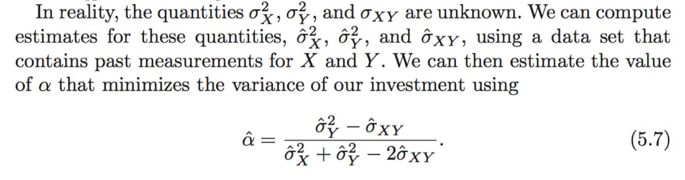

```{r setup, include=FALSE}
knitr::opts_chunk$set(echo = TRUE)
```

### 1. Requirement

use library(DAAG) to get the dataset litters

You are going to have to implement a version of `chapter 5 equation 5.7` for the litters data.

Notice that ?litters shows you how to create the models.

You need to attack the data in pairs:

- compare brain weight as a function of litter size
- compare brain weight as a function of body weight
- compare the output of summary(lm()) Standard Error to the output of boot() standard error
- extra credit: compare brain weight as a function of body weight and litter size

----------------

### 2. Equation 5.7:

<br>



---------------

<br>

### 3. Bootstrap Comparison

```{r message=FALSE}
library(dplyr)
library(ggplot2)
library(boot)
library(DAAG)
data(litters)

```

```{r}

glimpse(litters)

```

####  compare brain weight as a function of litter size / body weight

```{r}

boot_fn_1 = function (data, index) {

    return(coef(lm(brainwt ~ lsize, data=data, subset = index)))    
    
} # brain weight as a function of litter size

boot(litters, boot_fn_1, 500) # get bootstrap estimate for coef standard error

summary(lm(brainwt ~ lsize, data=litters))$coef # get lm estimates for coef stanard error

```

*comparing std. error estimates from both methods:*

| estimate method | se lsize       | se intercept   | 
| :-------------  | :------------- | :------------- |
| linear model    | 0.001198423    | 0.009624762    | 
| bootstrap       | 0.001322352    | 0.008576216    | 

The difference is due to the linear regression estimates rely on the linear assumption, but judging by the scatter plot below. The relationship between `brainwt` and `lsize` is loosely linear. (non-linear relationship is observable in the dataset)

Bootstrap being a inherently non-parametric method, doesn't rely on the linear assuption on the underlying dataset. Therefore, we can conclude that bootsrap generates more accurate estimate of the standard error, where linear model overestimate the intercept std. error and underestimate the slope std. error. 

```{r}

litters %>% 
    ggplot(aes(lsize, brainwt)) + 
    geom_point(size=2.5, alpha=0.7) + 
    geom_smooth(method = lm)

```


```{r}


boot_fn_2 = function (data, index) {

    return(coef(lm(brainwt ~ bodywt, data=data, subset = index)))    
    
} 

boot(litters, boot_fn_2, 500) 

summary(lm(brainwt ~ bodywt, data=litters))$coef


```


*comparing std. error estimates from both methods:*

| estimate method | se bodywt      | se intercept   | 
| :-------------  | :------------- | :------------- |
| linear model    | 0.002204185    | 0.017326748    | 
| bootstrap       | 0.002141026    | 0.017557333    | 

We have delineated the reason for the difference, but here we are seeing a better correspondence between these two methods, which is largely due to the linear model here fit the data better, which could be clearly observed from the scatter plot with the regression line. 


```{r}

litters %>% 
    ggplot(aes(lsize, bodywt)) + 
    geom_point(size=2.5, alpha=0.7) + 
    geom_smooth(method = lm)

```


#### extra credit: compare brain weight as a function of body weight and litter size

Before we solve this, we can hypothesize that because with both body weight and litter size, the linear model should fit the data better than two simple linear models above (second model has `0.53` adj-R-square, multiple linear model has `0.60`), thus the correspondence should be stronger than the second model. 


```{r}

boot_fn_3 = function (data, index) {

    return(coef(lm(brainwt ~ bodywt + lsize, data=data, subset = index)))    
    
} 

boot(litters, boot_fn_3, 500) 

summary(lm(brainwt ~ bodywt + lsize, data=litters))$coef

```

comparing std. error estimates from both methods:

| estimate method | se bodywt      | se lsize       | se intercept   | 
| :-------------  | :------------- | :------------- | :------------- |
| linear model    | 0.006778653    | 0.003132075    | 0.075322590    | 
| bootstrap       | 0.006930988    | 0.003127572    | 0.076452306    | 


